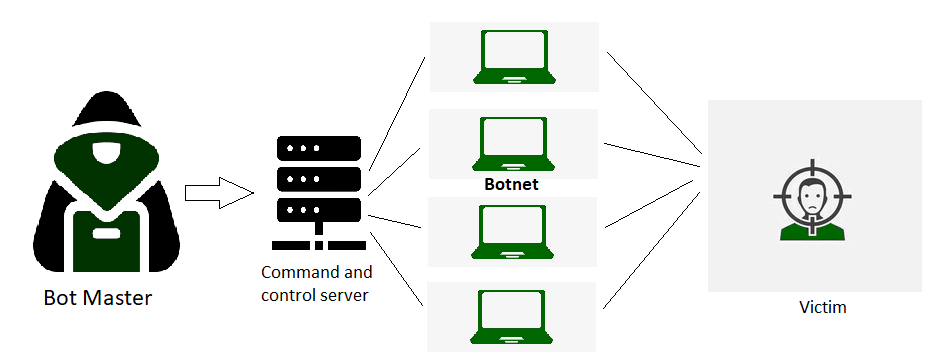

# Denial of service
Sampling a small scale Denial of Service attack.

## Introduction
A Denial of Service (DoS) attack is a malicious attempt to disrupt the normal traffic or functionality of a targeted server, service, or network by overwhelming it with an excessive flood of traffic or resource requests. This can lead to legitimate users being unable to access the services.

## Methodology
We demonstrated a small-scale DoS attack simulation, where a repeated payload is sent to a target IP and port using a socket connection. The number of iterations is determined randomly, simulating excessive requests to analyze system response under stress.

## Disclaimer
This code is intended solely for educational purposes or controlled testing in an authorized environment. Unauthorized execution of DoS attacks on any system or network is illegal and may result in severe legal consequences. Use responsibly and ethically.

## Use Cases
This code can be used in controlled and authorized environments to identify potential vulnerabilities in a system or network that may be susceptible to DoS attacks. By analyzing the system's response, you can implement appropriate mitigation strategies to enhance resilience against such threats.
